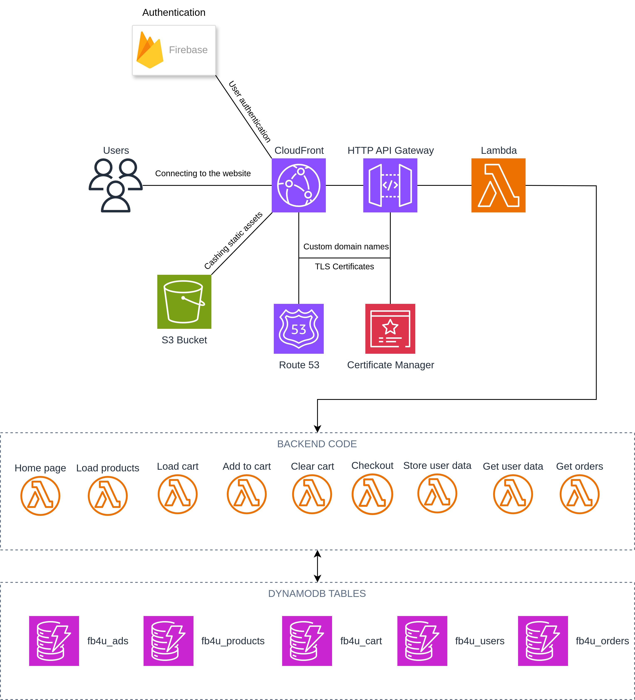

# S3-OL-PROJECT

Serverless Football Merchandise Store

This project is a scalable, cost-effective e-commerce application for browsing and purchasing football merchandise. It uses a fully serverless AWS backend managed with Terraform, CI pipelines with GitHub Actions and a modern Vue.js frontend. 

Personal Project was created in my third semester at Fontys HBO as a part of Open Learning programme. 

## Features

- **User Authentication**: Register and sign in with Firebase Authentication.
- **Product Catalog**: Browse products by category (kits, boots, accessories).
- **Product Details**: View detailed information, images, and pricing.
- **Shopping Cart**: Add items to cart, update or clear your cart.
- **Checkout**: Secure checkout flow with DynamoDB-powered cart and order tables.
- **Order Management**: Place orders, receive email confirmations via Amazon SES, and view past orders.
- **Profile Management**: Update user details and change passwords.
- **Infrastructure as Code**: Backend infrastructure defined with Terraform.
- **CI Scripts**: Automated data seeding and frontend build/deploy scripts.

## Architecture

### Backend (Serverless)

- **Route 53 + ACM**: DNS service which allows website to be accessible under `nknez.tech` domain with secure HTTPS connection
- **API Gateway**: Exposes HTTP endpoints under `api.nknez.tech`.
- **AWS Lambda**: Python functions as main backend engine in `/lambdas`:
  - `load_products` | `add_to_cart` | `load_cart` | `clear_cart` | `checkout`
  - `get_orders` | `get_user_data` | `store_user_data` | `home_page`
- **DynamoDB** tables:
  - `fb4u_products`, `fb4u_cart`, `fb4u_orders`, `fb4u_users`
- **Amazon SES**: Sends order confirmation emails.
- **Terraform**: Infrastructure code in `/terraform`:
  - API Gateway, Lambdas, DynamoDB, S3 bucket, CloudFront, SES configuration

### Frontend (Client)

- **Vue 3** + **Vite** + **Pinia** + **Tailwind CSS** in `/vue-website`
- **Firebase Auth** for user login/register
- **Axios** configured to `https://api.nknez.tech` for API calls
- Organised components under `/src/components`, route definitions in `/src/router` and Pinia stores in `/src/stores`

### Scripts

- `/scripts/data_injection.py`: Load initial product and ad data into DynamoDB from JSON files (`kits.json`, `boots.json`, `accessories.json`, `ads.json`).
- `/scripts/reload.sh`: Convenience script for re-seeding data.
- `/scripts/upload.sh`: Builds the frontend, syncs to S3 (`nknez.tech`), and invalidates CloudFront cache.
